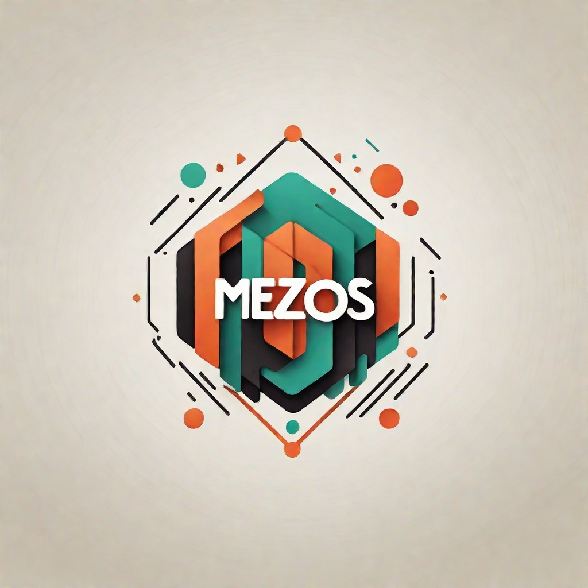

---

# 🧩 MEZOS — FiveM Developer | QBCore & ESX Expert

> 🎯 *Bringing creativity, optimization, and realism to the FiveM world — one line of code at a time.*

---

## 🚀 About Me

👋 Hi! I’m **Mezos**, a **FiveM Developer** specialized in building **custom QBCore and ESX scripts**, creating **immersive RP experiences**, and optimizing **server performance** for maximum player satisfaction.

With years of hands-on experience, I’ve mastered the art of designing efficient, scalable, and modular systems that make any server stand out.

---

## 🛠️ Tech Stack

| Category             | Tools & Technologies                          |
| -------------------- | --------------------------------------------- |
| 🧠 Frameworks        | QBCore, ESX                                   |
| 💻 Languages         | Lua, JavaScript, HTML, CSS, SQL               |
| ⚙️ Server Management | TXAdmin, Zap Hosting, VPS / Dedicated Servers |
| 🧩 Databases         | MySQL, MariaDB                                |
| 🧰 Tools             | Visual Studio Code, Git, Vercel, Notion       |
| 🎨 UI/UX             | NUI, React, Bootstrap, Tailwind               |

---

## 🔥 What I Do

✅ Custom script creation (from scratch)
✅ Server optimization and bug fixing
✅ Conversion between QBCore ↔ ESX
✅ UI/UX integration for in-game menus (NUI)
✅ Advanced RP systems (banking, jobs, inventory, etc.)
✅ Full server setup (Ready-To-Play configurations)
✅ Discord bot integration and API systems

---

## 💡 Featured Projects

| Project                             | Description                                                              | Framework    |
| ----------------------------------- | ------------------------------------------------------------------------ | ------------ |
| 🏦 **Codem Bank System**            | Advanced banking system with UI, stashes, and robbery logic.             | QBCore       |
| 🚓 **Police MDT**                   | Real-time database system with player lookup, vehicle info, and reports. | ESX          |
| 🍔 **UwU Café Job**                 | Custom interactive job with items, stashes, animations, and crafting.    | QBCore       |
| 💊 **Diseases & Medication System** | Realistic sickness mechanic + cure items & effects.                      | QBCore       |
| ⚡ **Advanced Inventory**            | Modern inventory integrated with weapons & items metadata.               | ox_inventory |

---

## 📊 GitHub Stats

  
  

---

## 🧠 Philosophy

> *“Good servers aren’t built by luck — they’re built by logic, optimization, and a touch of imagination.”*

I focus on **clean code**, **modular design**, and **player experience**. Every script I make is lightweight, optimized, and fully documented.

---

## 📫 Contact

💼 **Discord:** `_mezos`

---

## 💬 Let’s Build Something Great

If you’re looking for a **custom script**, **full FiveM setup**, or **server optimization**, feel free to reach out!
I’m always open to **freelance projects** and **collaborations**.

> ✨ *Quality, performance, and creativity — that’s the MEZOS touch.*

---
